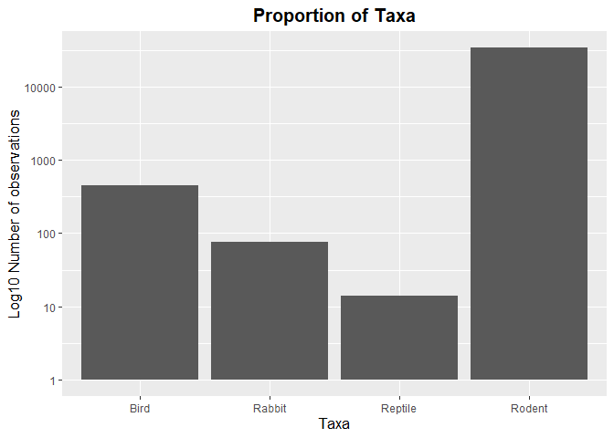
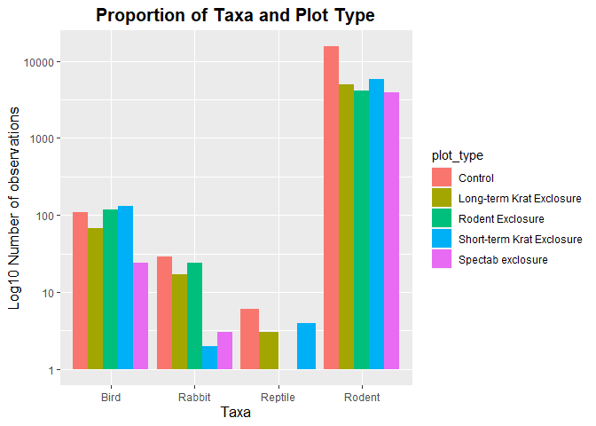
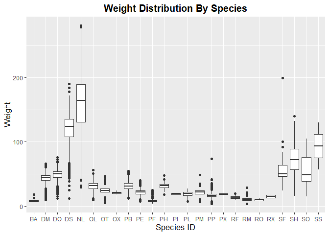
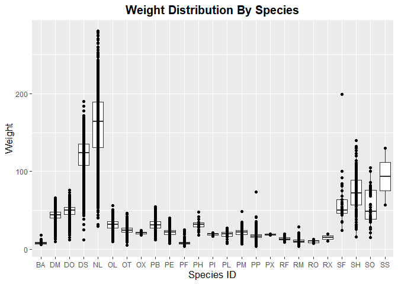
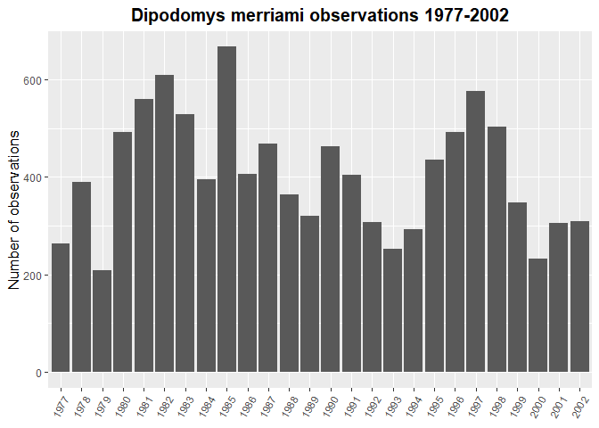
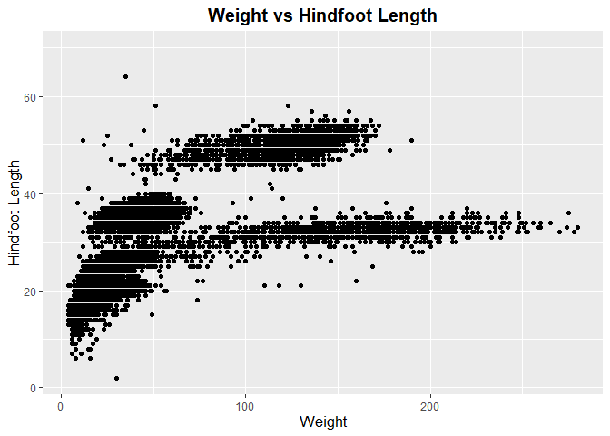
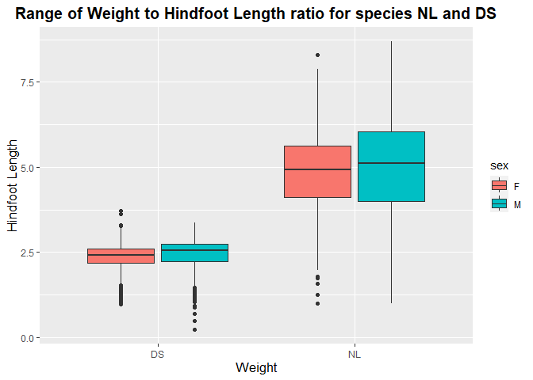
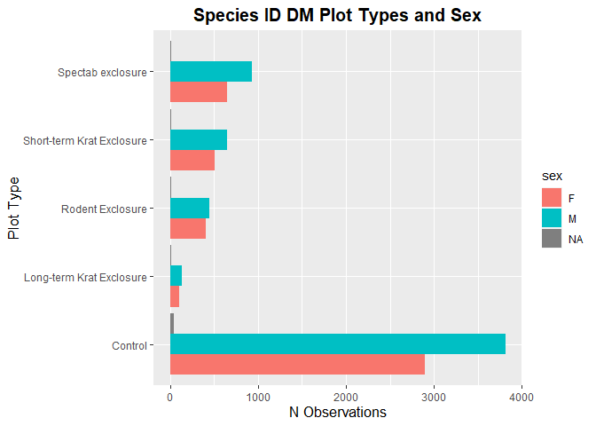

## Instructions
Answer the following questions and complete the exercises in RMarkdown. Please embed all of your code and push your final work to your repository. Your final lab report should be organized, clean, and run free from errors. Remember, you must remove the `#` for the included code chunks to run. Be sure to add your name to the author header above. For any included plots, make sure they are clearly labeled. You are free to use any plot type that you feel best communicates the results of your analysis.  

Make sure to use the formatting conventions of RMarkdown to make your report neat and clean!  

## Load the libraries

```r
library(tidyverse)
library(janitor)
library(here)
library(naniar)
```

## Desert Ecology
For this assignment, we are going to use a modified data set on [desert ecology](http://esapubs.org/archive/ecol/E090/118/). The data are from: S. K. Morgan Ernest, Thomas J. Valone, and James H. Brown. 2009. Long-term monitoring and experimental manipulation of a Chihuahuan Desert ecosystem near Portal, Arizona, USA. Ecology 90:1708.

```r
deserts <- read_csv(here("lab10", "data", "surveys_complete.csv"))
```

```
## Rows: 34786 Columns: 13
## ── Column specification ────────────────────────────────────────────────────────
## Delimiter: ","
## chr (6): species_id, sex, genus, species, taxa, plot_type
## dbl (7): record_id, month, day, year, plot_id, hindfoot_length, weight
## 
## ℹ Use `spec()` to retrieve the full column specification for this data.
## ℹ Specify the column types or set `show_col_types = FALSE` to quiet this message.
```

1. Use the function(s) of your choice to get an idea of its structure, including how NA's are treated. Are the data tidy?  

- yes, the data is tidy. Each variable has its own column, each observation its own row and each value its unique position. NA's are represented accurately and titles are clean.

```r
head(deserts)
```

```
## # A tibble: 6 × 13
##   record_id month   day  year plot_id speci…¹ sex   hindf…² weight genus species
##       <dbl> <dbl> <dbl> <dbl>   <dbl> <chr>   <chr>   <dbl>  <dbl> <chr> <chr>  
## 1         1     7    16  1977       2 NL      M          32     NA Neot… albigu…
## 2         2     7    16  1977       3 NL      M          33     NA Neot… albigu…
## 3         3     7    16  1977       2 DM      F          37     NA Dipo… merria…
## 4         4     7    16  1977       7 DM      M          36     NA Dipo… merria…
## 5         5     7    16  1977       3 DM      M          35     NA Dipo… merria…
## 6         6     7    16  1977       1 PF      M          14     NA Pero… flavus 
## # … with 2 more variables: taxa <chr>, plot_type <chr>, and abbreviated
## #   variable names ¹​species_id, ²​hindfoot_length
```


```r
glimpse(deserts)
```

```
## Rows: 34,786
## Columns: 13
## $ record_id       <dbl> 1, 2, 3, 4, 5, 6, 7, 8, 9, 10, 11, 12, 13, 14, 15, 16,…
## $ month           <dbl> 7, 7, 7, 7, 7, 7, 7, 7, 7, 7, 7, 7, 7, 7, 7, 7, 7, 7, …
## $ day             <dbl> 16, 16, 16, 16, 16, 16, 16, 16, 16, 16, 16, 16, 16, 16…
## $ year            <dbl> 1977, 1977, 1977, 1977, 1977, 1977, 1977, 1977, 1977, …
## $ plot_id         <dbl> 2, 3, 2, 7, 3, 1, 2, 1, 1, 6, 5, 7, 3, 8, 6, 4, 3, 2, …
## $ species_id      <chr> "NL", "NL", "DM", "DM", "DM", "PF", "PE", "DM", "DM", …
## $ sex             <chr> "M", "M", "F", "M", "M", "M", "F", "M", "F", "F", "F",…
## $ hindfoot_length <dbl> 32, 33, 37, 36, 35, 14, NA, 37, 34, 20, 53, 38, 35, NA…
## $ weight          <dbl> NA, NA, NA, NA, NA, NA, NA, NA, NA, NA, NA, NA, NA, NA…
## $ genus           <chr> "Neotoma", "Neotoma", "Dipodomys", "Dipodomys", "Dipod…
## $ species         <chr> "albigula", "albigula", "merriami", "merriami", "merri…
## $ taxa            <chr> "Rodent", "Rodent", "Rodent", "Rodent", "Rodent", "Rod…
## $ plot_type       <chr> "Control", "Long-term Krat Exclosure", "Control", "Rod…
```

```r
naniar::miss_var_summary(deserts)
```

```
## # A tibble: 13 × 3
##    variable        n_miss pct_miss
##    <chr>            <int>    <dbl>
##  1 hindfoot_length   3348     9.62
##  2 weight            2503     7.20
##  3 sex               1748     5.03
##  4 record_id            0     0   
##  5 month                0     0   
##  6 day                  0     0   
##  7 year                 0     0   
##  8 plot_id              0     0   
##  9 species_id           0     0   
## 10 genus                0     0   
## 11 species              0     0   
## 12 taxa                 0     0   
## 13 plot_type            0     0
```

2. How many genera and species are represented in the data? What are the total number of observations? Which species is most/ least frequently sampled in the study?

- Number of genera

```r
n_distinct(deserts$genus)
```

```
## [1] 26
```
- Number of species

```r
n_distinct(deserts$species)
```

```
## [1] 40
```
- Number of observations in the data set : 34786 

```r
dim(deserts)
```

```
## [1] 34786    13
```
- Least sampled species

```r
deserts %>% 
  count(species_id) %>% 
  slice_min(order_by = n)
```

```
## # A tibble: 6 × 2
##   species_id     n
##   <chr>      <int>
## 1 CS             1
## 2 CT             1
## 3 CU             1
## 4 CV             1
## 5 SC             1
## 6 ST             1
```
- Most sampled species

```r
deserts %>% 
  count(species_id) %>% 
  slice_max(order_by = n)
```

```
## # A tibble: 1 × 2
##   species_id     n
##   <chr>      <int>
## 1 DM         10596
```

3. What is the proportion of taxa included in this study? Show a table and plot that reflects this count.

```r
deserts %>% 
  count(taxa)
```

```
## # A tibble: 4 × 2
##   taxa        n
##   <chr>   <int>
## 1 Bird      450
## 2 Rabbit     75
## 3 Reptile    14
## 4 Rodent  34247
```

```r
deserts %>% 
  ggplot(aes(x=taxa, ))+
  geom_bar() +
  scale_y_log10() +
  labs(title = "Proportion of Taxa", x = "Taxa", y="Log10 Number of observations")+
  theme(plot.title = element_text(size = 15, hjust = 0.5, face = "bold"), axis.title = element_text(size = 13))
```

<!-- -->

4. For the taxa included in the study, use the fill option to show the proportion of individuals sampled by `plot_type.`

```r
deserts %>% 
  ggplot(aes(x=taxa, fill=plot_type))+
  geom_bar(position = "dodge") +
  scale_y_log10() +
  labs(title = "Proportion of Taxa and Plot Type", x = "Taxa", y="Log10 Number of observations")+
  theme(plot.title = element_text(size = 15, hjust = 0.5, face = "bold"), axis.title = element_text(size = 13))
```

<!-- -->

5. What is the range of weight for each species included in the study? Remove any observations of weight that are NA so they do not show up in the plot.

```r
deserts %>% 
  filter(weight!="NA") %>% 
  ggplot(aes(x=species_id , y=weight))+
  geom_boxplot()+
  labs(title = "Weight Distribution By Species", x = "Species ID", y="Weight")+
  theme(plot.title = element_text(size = 15, hjust = 0.5, face = "bold"), axis.title = element_text(size = 13))
```

<!-- -->

6. Add another layer to your answer from #5 using `geom_point` to get an idea of how many measurements were taken for each species.

```r
deserts %>% 
  filter(weight!="NA") %>% 
  ggplot(aes(x=species_id , y=weight))+
  geom_boxplot() +
  geom_point()+
  labs(title = "Weight Distribution By Species", x = "Species ID", y="Weight")+
  theme(plot.title = element_text(size = 15, hjust = 0.5, face = "bold"), axis.title = element_text(size = 13))
```

<!-- -->
7. [Dipodomys merriami](https://en.wikipedia.org/wiki/Merriam's_kangaroo_rat) is the most frequently sampled animal in the study. How have the number of observations of this species changed over the years included in the study?

- The numbers have been declining between 1977 and 2002

```r
deserts %>% 
  filter(species == "merriami") %>% 
  count(year)
```

```
## # A tibble: 26 × 2
##     year     n
##    <dbl> <int>
##  1  1977   264
##  2  1978   389
##  3  1979   209
##  4  1980   493
##  5  1981   559
##  6  1982   609
##  7  1983   528
##  8  1984   396
##  9  1985   667
## 10  1986   406
## # … with 16 more rows
```

```r
deserts %>% 
  filter(species == "merriami") %>% 
  ggplot(aes(x=as.factor(year)))+
  geom_bar()+
  labs(title = "Dipodomys merriami observations 1977-2002", x = NULL, y="Number of observations")+
  theme(plot.title = element_text(size = 15, hjust = 0.5, face = "bold"), axis.title = element_text(size = 13), axis.text.x = element_text(angle = 60, hjust = 1))
```

<!-- -->

8. What is the relationship between `weight` and `hindfoot` length? Consider whether or not over plotting is an issue.

- Overplotting is definitely an issue as we can see several overlapping observations

```r
deserts %>% 
  ggplot(aes(x=weight, y=hindfoot_length))+
  geom_point(na.rm = T)+
  labs(title = "Weight vs Hindfoot Length", x = "Weight", y="Hindfoot Length")+
  theme(plot.title = element_text(size = 15, hjust = 0.5, face = "bold"), axis.title = element_text(size = 13))
```

<!-- -->

9. Which two species have, on average, the highest weight? Once you have identified them, make a new column that is a ratio of `weight` to `hindfoot_length`. Make a plot that shows the range of this new ratio and fill by sex.


```r
deserts %>% 
  group_by(species_id) %>% 
  summarise(mean_weight = mean(weight, na.rm = T)) %>% 
  slice_max(order_by = mean_weight, n = 2)
```

```
## # A tibble: 2 × 2
##   species_id mean_weight
##   <chr>            <dbl>
## 1 NL                159.
## 2 DS                120.
```

```r
deserts %>% 
  filter(species_id == "NL" | species_id == "DS") %>% 
  filter(weight!= "NA" & hindfoot_length != "NA"  & sex  != "NA") %>% 
  mutate(ratio = weight/hindfoot_length) %>% 
  ggplot(aes(x=species_id, y=ratio, fill=sex))+
  geom_boxplot()+
  labs(title = "Range of Weight to Hindfoot Length ratio for species NL and DS", x = "Weight", y="Hindfoot Length")+
  theme(plot.title = element_text(size = 15, hjust = 0.5, face = "bold"), axis.title = element_text(size = 13))
```

<!-- -->

10. Make one plot of your choice! Make sure to include at least two of the aesthetics options you have learned.

- Exploring plot types used to collect data for most sampled species , species ID DM, and the proportion of individuals for each sex

```r
deserts %>% 
  filter(species_id == "DM") %>% 
  ggplot(aes(x=plot_type, fill = sex))+
  geom_bar(position = "dodge")+
  coord_flip()+
  labs(title = "Species ID DM Plot Types and Sex", x = "Plot Type", y="N Observations")+
  theme(plot.title = element_text(size = 15, hjust = 0.5, face = "bold"), axis.title = element_text(size = 13))
```

<!-- -->

## Push your final code to GitHub!
Please be sure that you check the `keep md` file in the knit preferences. 
